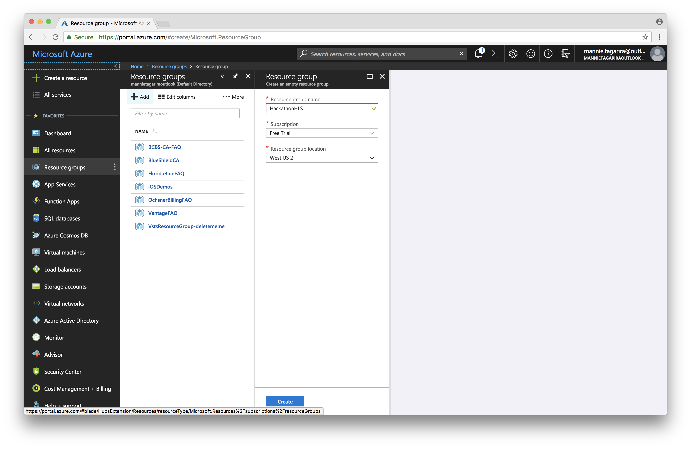

# Resource Groups

The _Resource Group_ will act as a container for all the different components of this project. Be sure to select a _Resouce Group Location_ that contains most/all of the following services as per [service availability reference](https://azure.microsoft.com/en-us/global-infrastructure/services/):
* Azure Search
* Azure Bot Service
* Language Understanding (LUIS)
* Logic Apps
* Functions
* Visual Studio Team Services

1. Click _Resource Groups_ in the navigation menu.
1. Click _Add_ in the _Resource Groups_ panel.
1. Add a unique name for the resource group; give it a name related to the project.
1. Hit _Create_.
