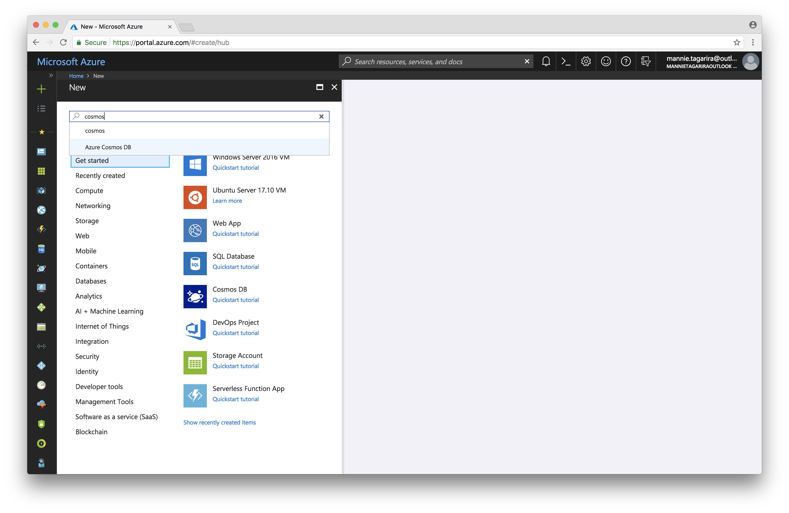
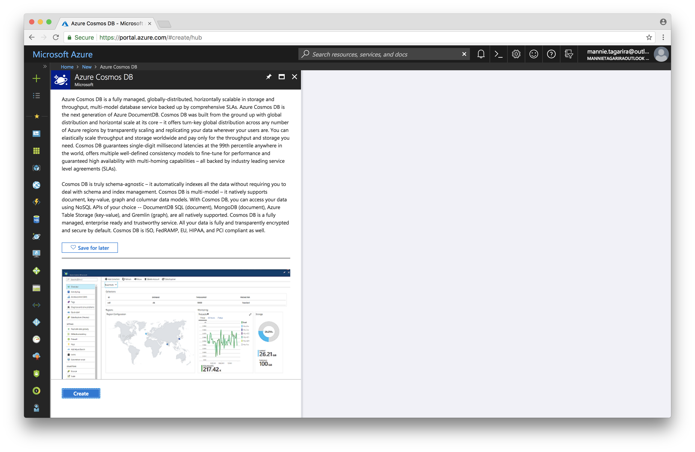
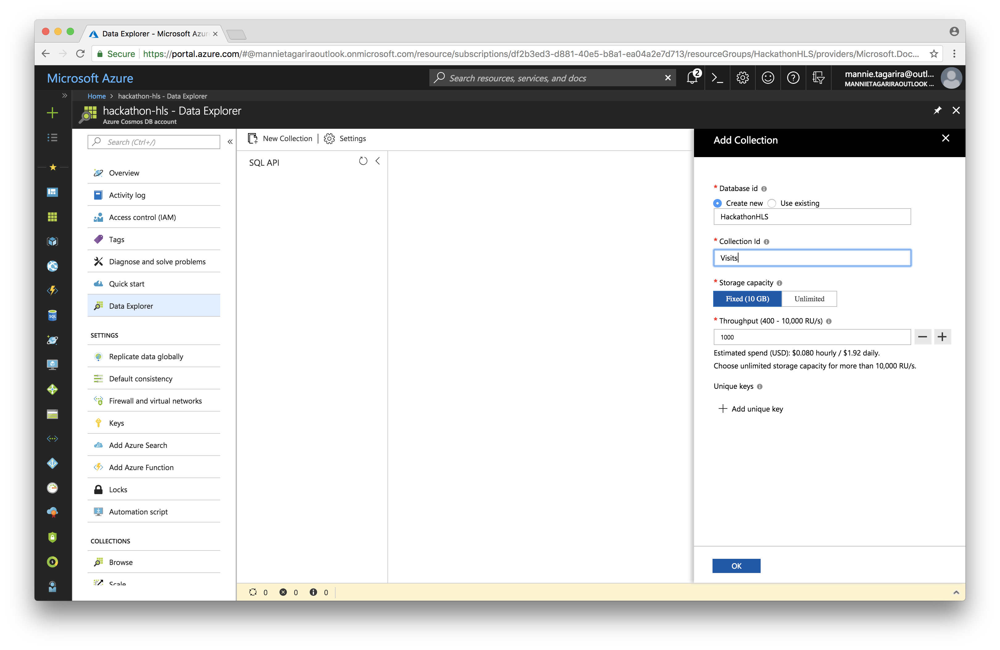

# Cosmos DB

Cosmos DB is a high-throughput distributed database

---

1. Click on _Create a resource_ and search for _Azure Cosmos DB_.

1. Click _Create_ to navigate to the page to configure your Cosmos DB instance.

1. Enter an _ID_ for your Cosmos DB. Be sure to select _SQL_ as the _API_, and reuse the _Resource Group_ from prior steps.

1. Once the database has been created, navigate to _Data Explorer_ and click _New Collection_. This will open a form asking for a an _ID_ for the new database and another for the collection. This collection is what we will be using to hold the data in later parts of the workshop.

