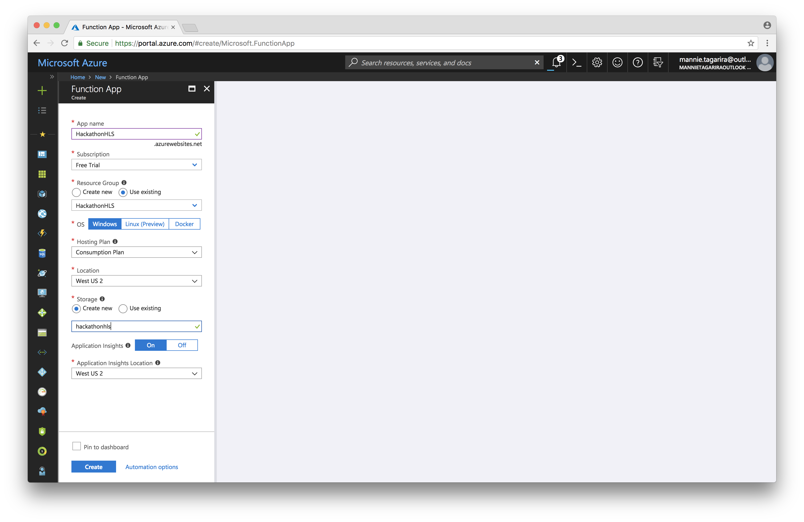
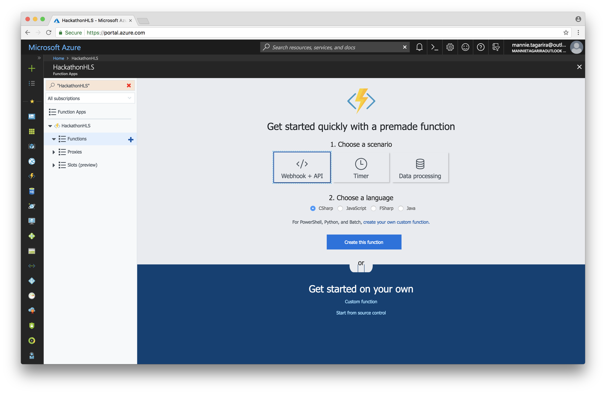
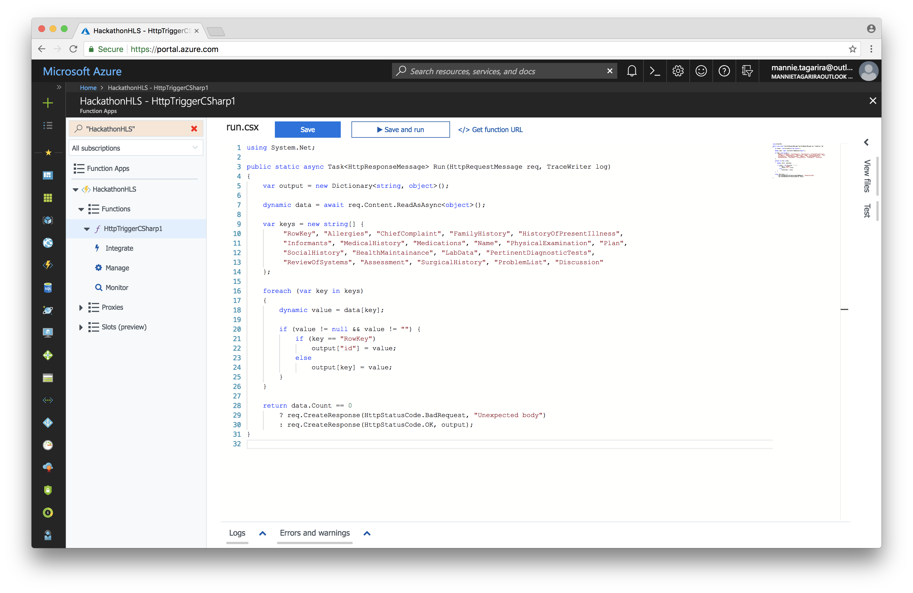
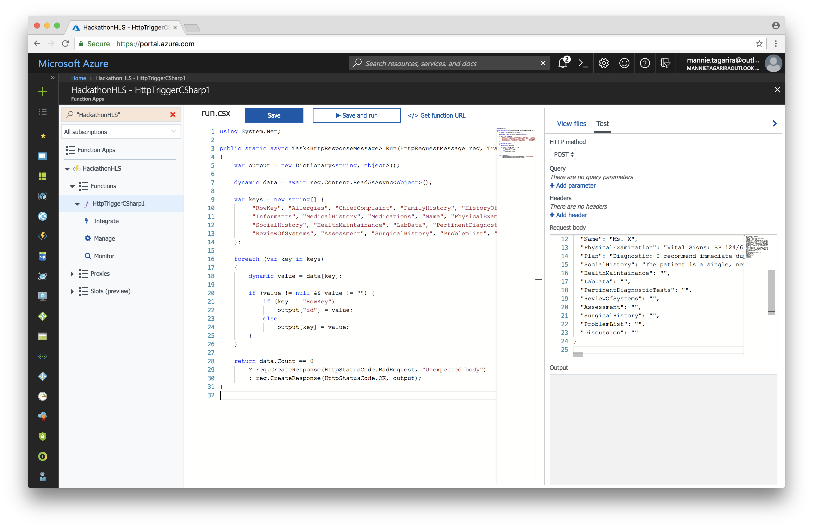
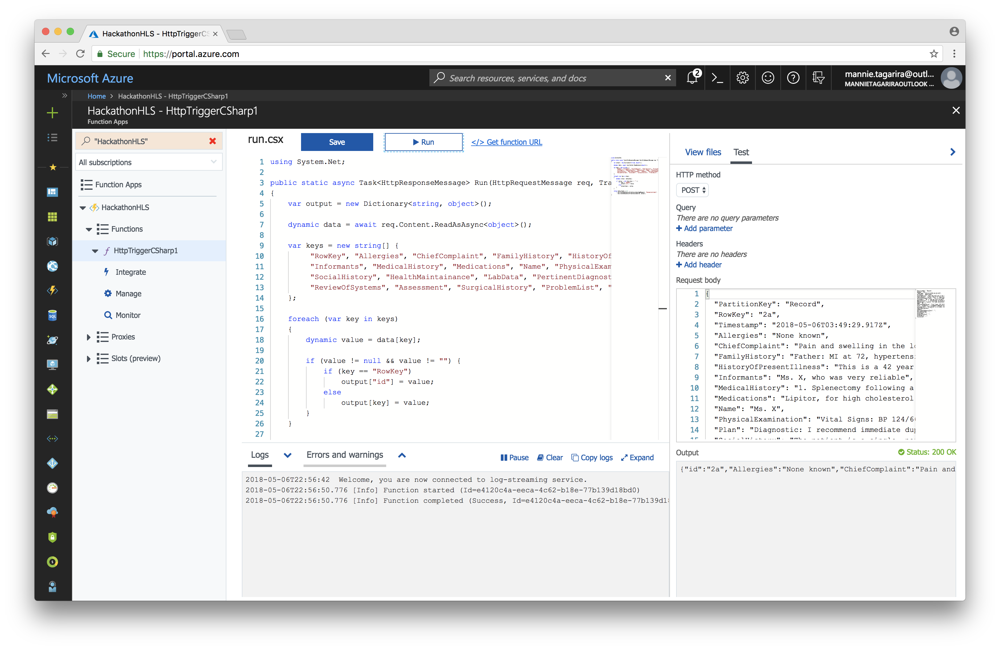
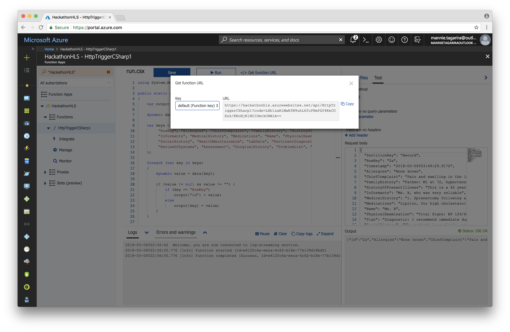

# Functions

Azure Functions is a serverless compute service that enables you to run code on-demand without having to explicitly provision or manage infrastructure. Use Azure Functions to run a script or piece of code in response to a variety of events.

Learn more about [Functions](https://azure.microsoft.com/en-us/services/functions/) by referring to the [documentation](https://docs.microsoft.com/en-us/azure/azure-functions/).

---

1. Click on _Create a resource_; select _Function App_, which lives under the _Compute_ category.

1. Fill in the form requesting information about your Function App. Be sure to select the Resource Group created in prior sections.

1. Once the Function App has been deployed, navigate to it and click the __+__ button next to the _Functions_ grouping. Click _Create this functions_ with _Webhook + API_ selected as the scenario and _CSharp_ as the language.

1. The code editor for the function should launch; when it does, replace the existing code with the code in [function.csx](function.csx).

1. In order to test that the code is performing the expected behaviour, click on the tab labelled _Test_ and paste the contents of [visit.json](visit.json) into the text box labelled _Request body_.

1. On clicking _Save and run_, the _Output_ section should contain a sanitized version of [visit.json](visit.json): all the fields whose value is an empty string (i.e. `""`) have been removed.

1. Before proceeding to the next section, ensure to note down the functions URL. Click on _Get Function URL_, and then on _Copy_ in the pop-up that follows.

