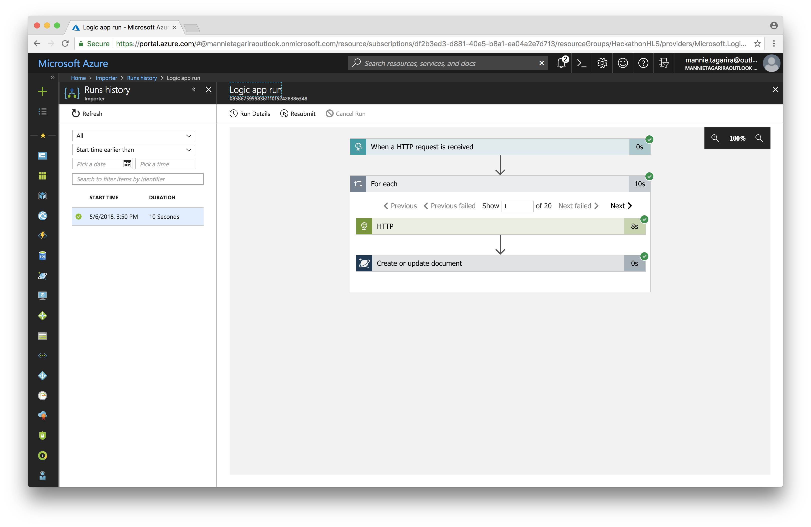
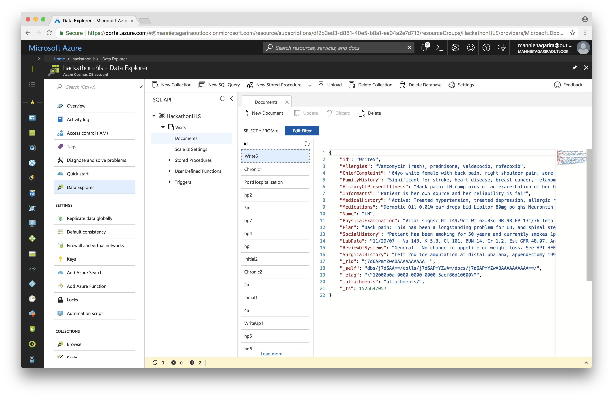

# Logic Apps

Logic Apps helps you build, schedule, and automate processes as workflows so you can integrate apps, data, systems, and services across enterprises or organizations. Logic Apps simplifies how you design and create scalable solutions for app integration, data integration, system integration, enterprise application integration (EAI), and business-to-business (B2B) communication, whether in the cloud, on premises, or both.

For example, here are just a few workloads that you can automate with logic apps:
* Process and route orders across on-premises systems and cloud services.
* Move uploaded files from an FTP server to Azure Storage.
* Monitor tweets for a specific subject, analyze the sentiment, and create alerts or tasks for items that need review.

Learn more about [Logic Apps](https://azure.microsoft.com/en-us/services/logic-apps/) by referring to the [documentation](https://docs.microsoft.com/en-us/azure/logic-apps/).

---

