# Logic Apps

Logic Apps helps you build, schedule, and automate processes as workflows so you can integrate apps, data, systems, and services across enterprises or organizations. Logic Apps simplifies how you design and create scalable solutions for app integration, data integration, system integration, enterprise application integration (EAI), and business-to-business (B2B) communication, whether in the cloud, on premises, or both.

For example, here are just a few workloads that you can automate with logic apps:
* Process and route orders across on-premises systems and cloud services.
* Move uploaded files from an FTP server to Azure Storage.
* Monitor tweets for a specific subject, analyze the sentiment, and create alerts or tasks for items that need review.

Learn more about [Logic Apps](https://azure.microsoft.com/en-us/services/logic-apps/) by referring to the [documentation](https://docs.microsoft.com/en-us/azure/logic-apps/).

---

1. Navigate to the resource by clicking _Create a resource_, _Mobile_, then _Logic App_.
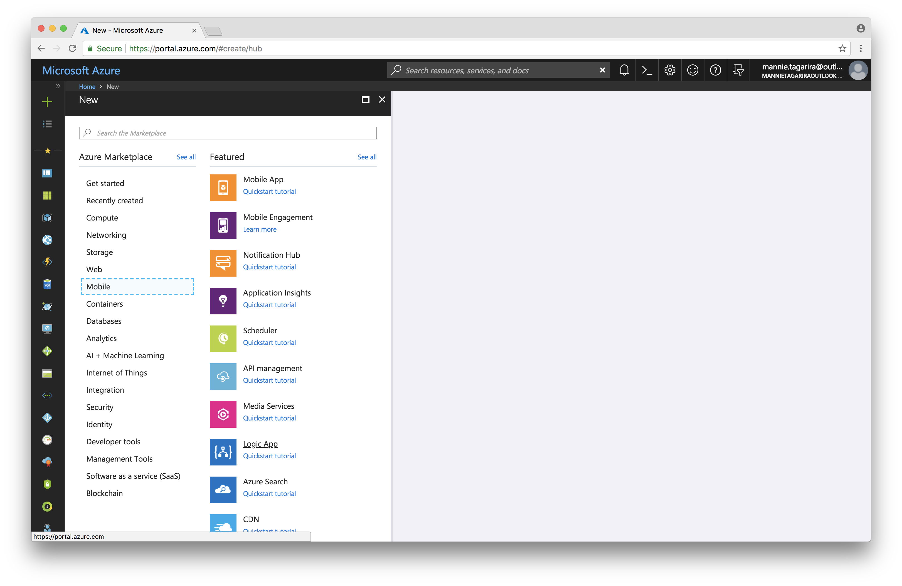

1. Give the Logic App a name and select the resource group from prior sections.
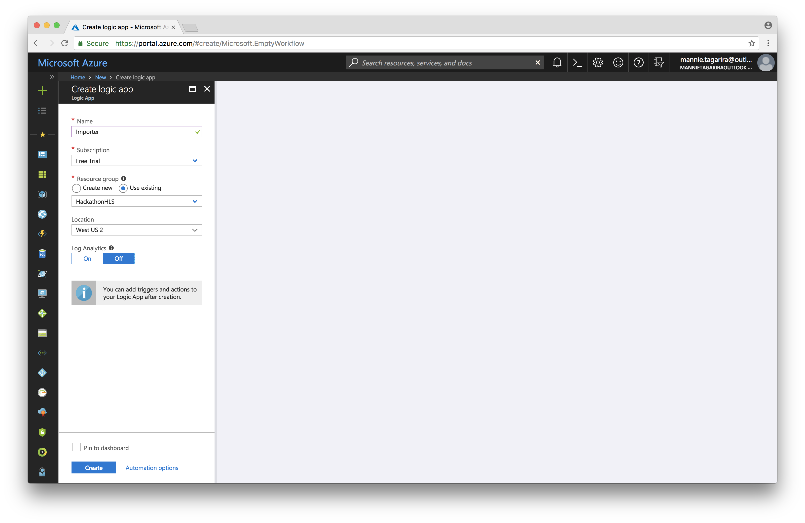

1. Once the Logic App has been deployed, click _Edit_ to open the Logic App for modification. _This step might not be required; in some cases, the Logic App will automatically open on access._
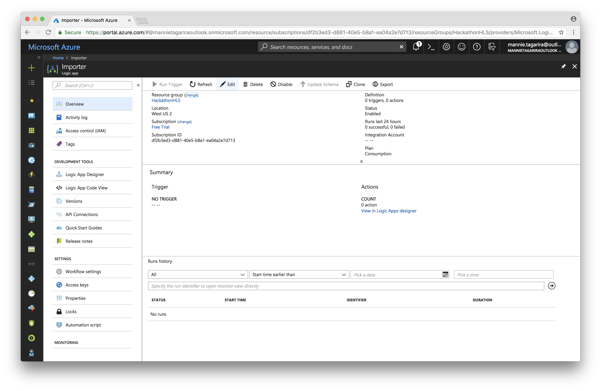

1. Select the _Blank Logic App_ template.
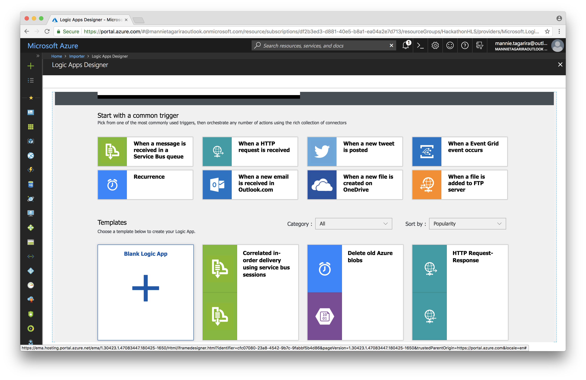

1. Select _Request_ to show the HTTP triggers. 
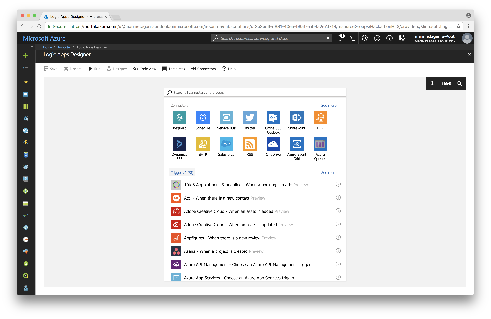

1. Select the trigger for _When a HTTP request is recieved_.
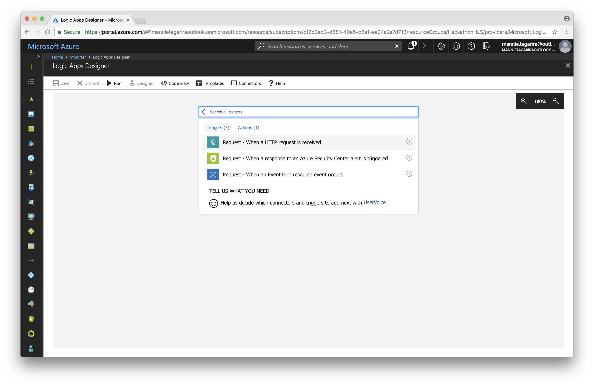

1. Click on _Use sample payload to generate schema_. Paste the contents of [visits_skeleton.json](visits_skeleton.json) into the pop-up the appears.
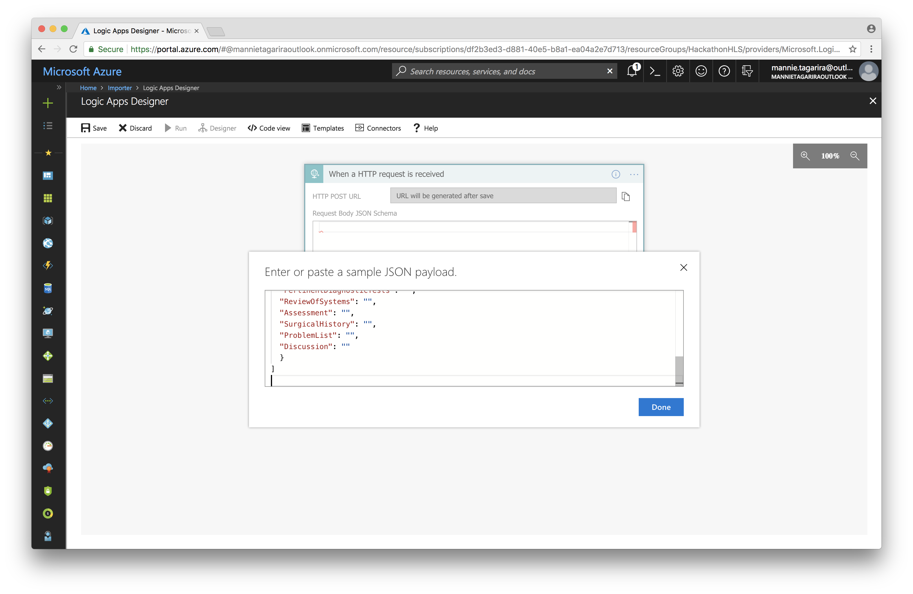

1. Select the _Add a for each_ option under the _More_ section of _+ New step_.

1. Click in the field labelled _Select an output from previous steps_. This will open up a pop-up; select _Body_ from that pop-up. If the pop-up does not appear, click _Add dynamic content_ to make it appear.

1. Click on _Add an action_ which appears at the bottom of the _For each_ widget. Select the _HTTP_ connector.
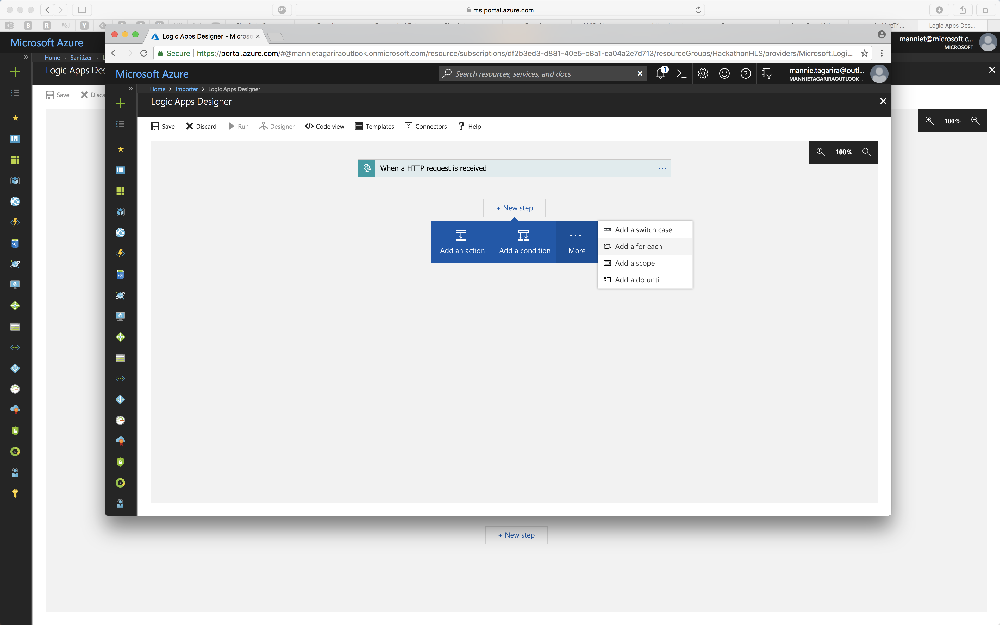

1. Select the _HTTP - HTTP_ action;
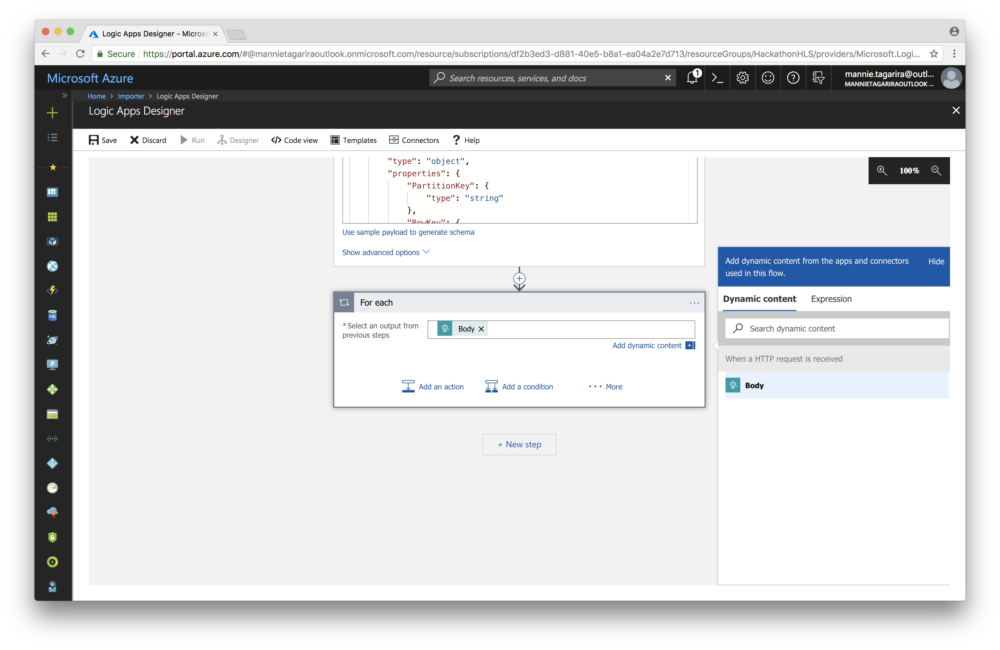

1. Set the HTTP method to _POST_ and paste the URL to the Function (for data sanitization) created in the previous section into the _Uri_ field. Set the _Body_ of the request to the _Current item_ of the _For each_.
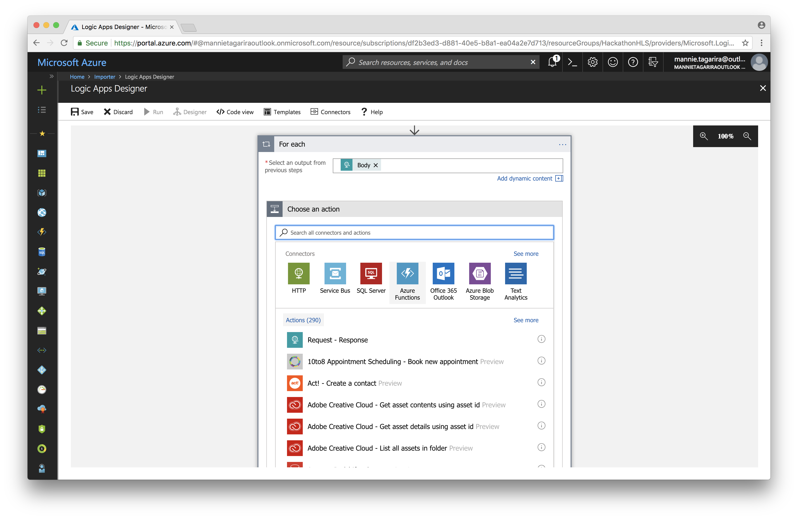

1. Select _Add an action_, and filter down the results to find _Cosmos DB_. Select the _Create or update document_ action from the filtered list.
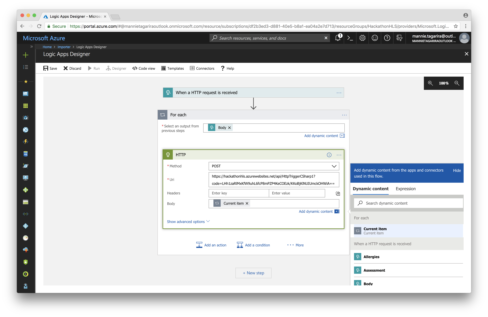

1. You will be prompted to connect to a Cosmos DB resource; give the _connection_ a name and select the _DocumentDB_ created in previous sections.
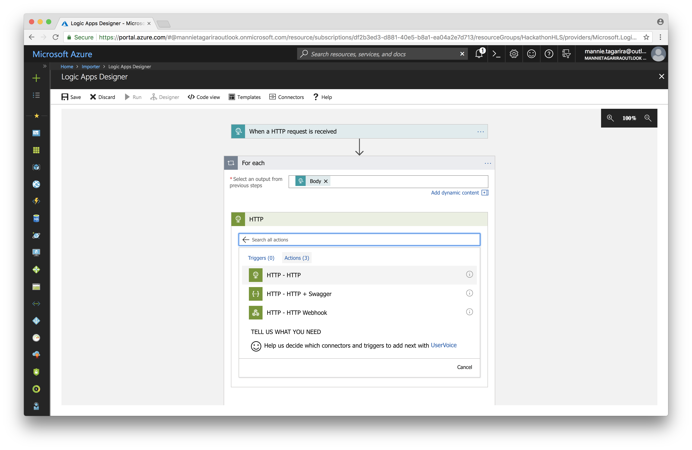

1. Select the _Database ID_ and _Collection ID_ corresponding with the collection created earlier. Set the _Body_ of the response from the Function (i.e. the sanitized record) as the _Document_ to be inserted. Ensure _IsUpsert_ is set to _Yes_.

1. _Save_ the Logic App. The Logic App should now have an endpoint that we can post data to; copy the _HTTP POST URL_ from Logic App's trigger action.

1. In Postman, select _POST_ as the HTTP method to use and paste the Logic App's _HTTP POST URL_ into the request URL field. Under the _Body_ section of the request, select _raw_ and set the content-type to _JSON (application/json)_. Paste the contents of [visits.json](visits.json) into the text field, and click _Send_.
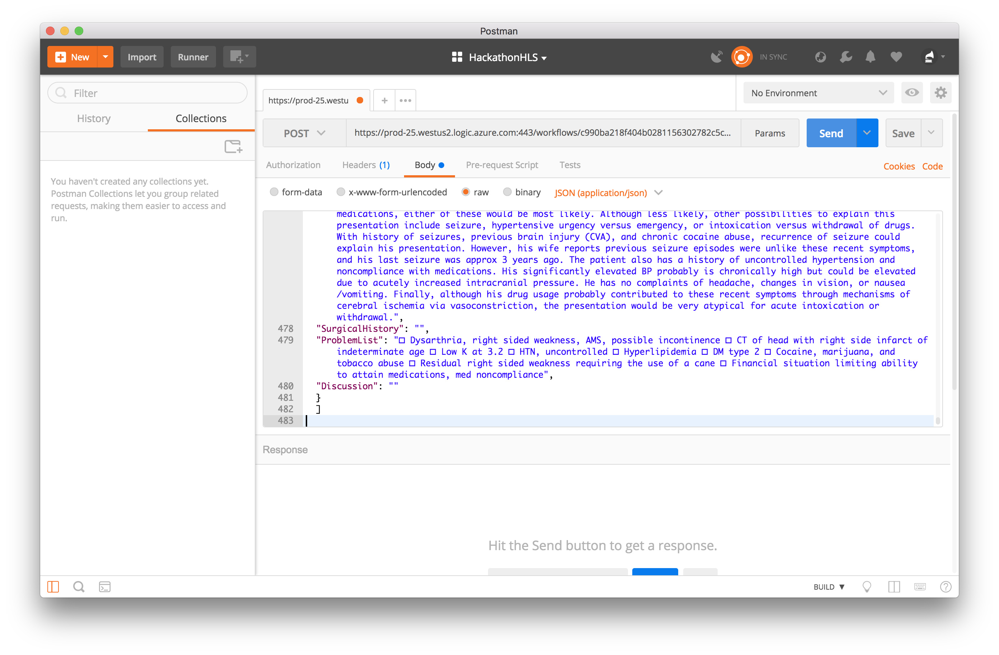

1. To verify that that Logic App ran successfully, visit the _Runs history_ section of the Logic App and select the latest run.
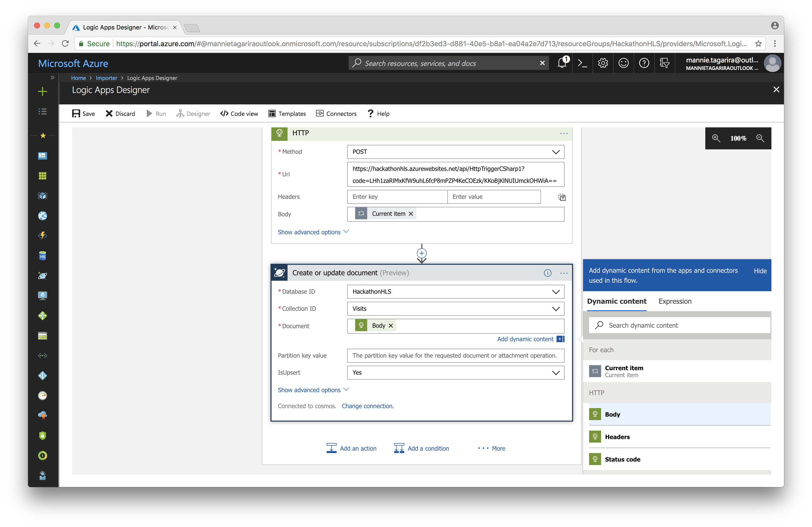

1. To verify that the data was imported into Cosmos DB successfully, open the Cosmos DB _Data Explorer_, and navigate to the relevant collection.
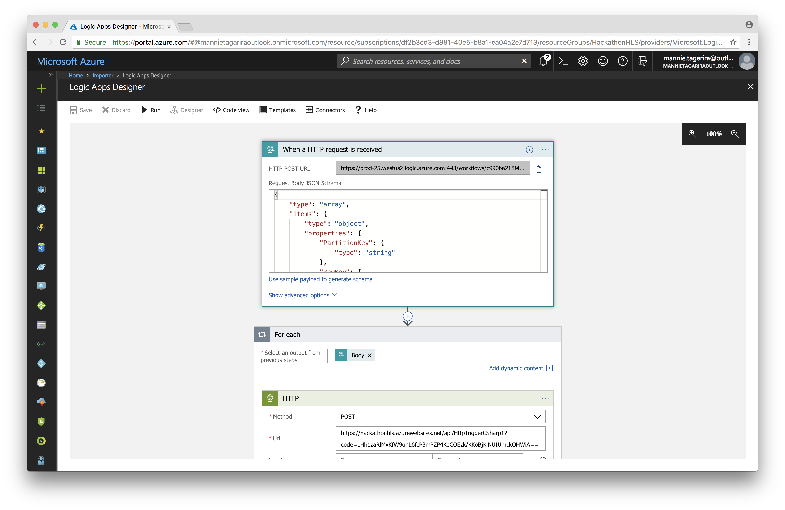
