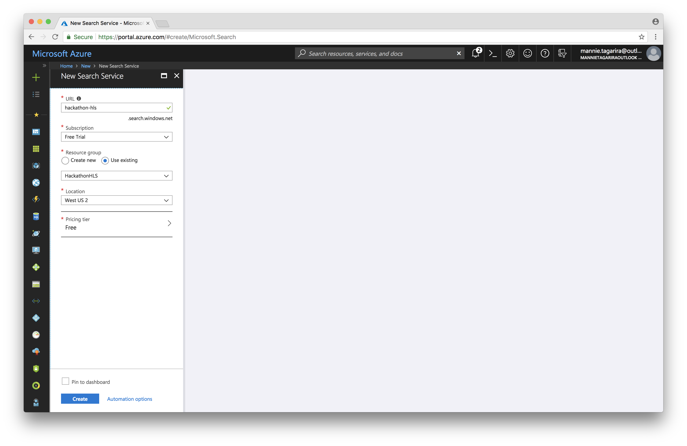
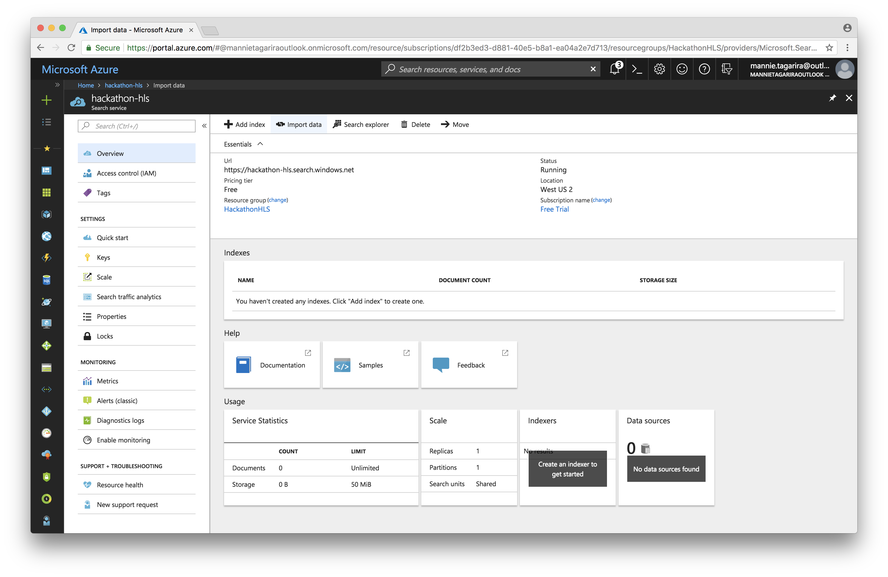
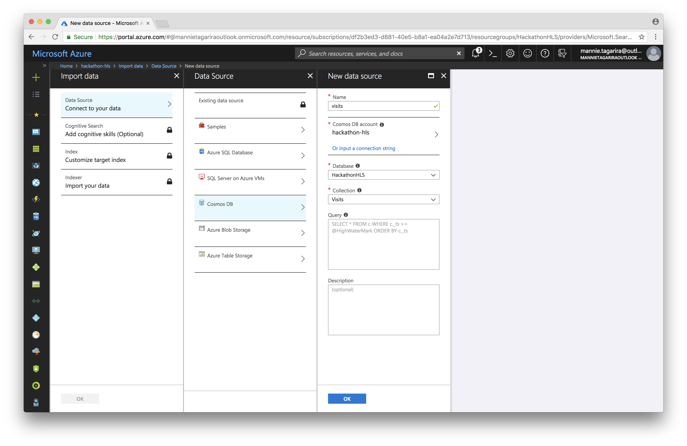
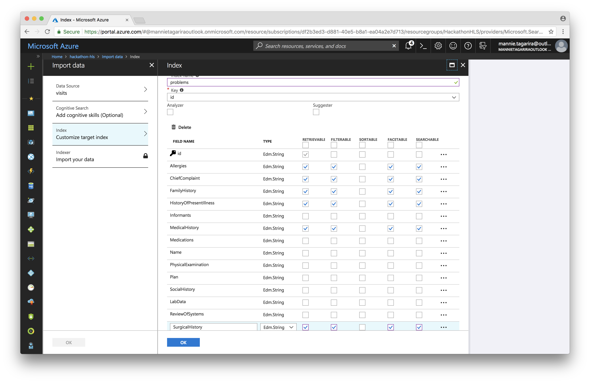
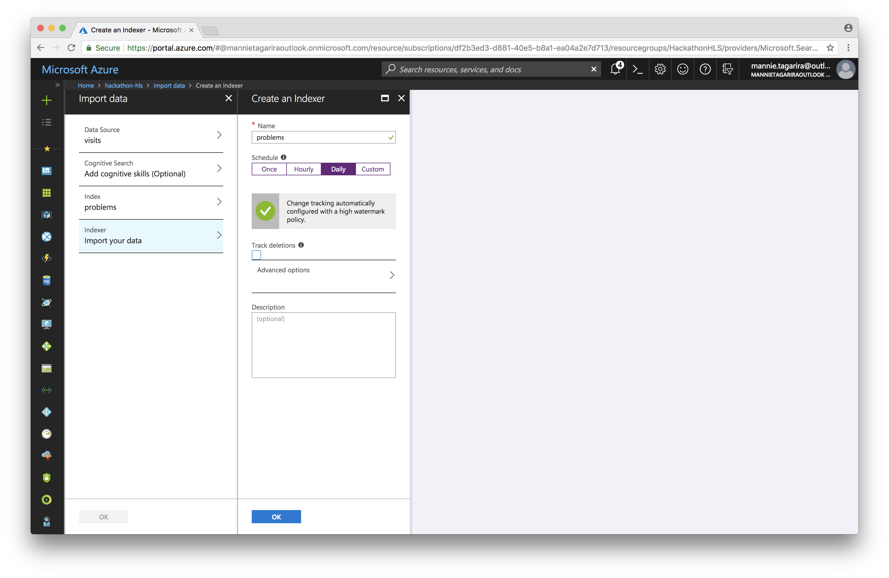
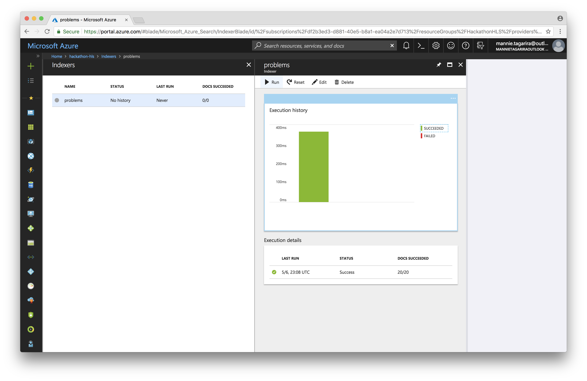
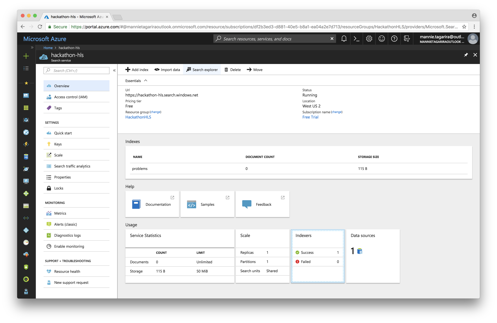
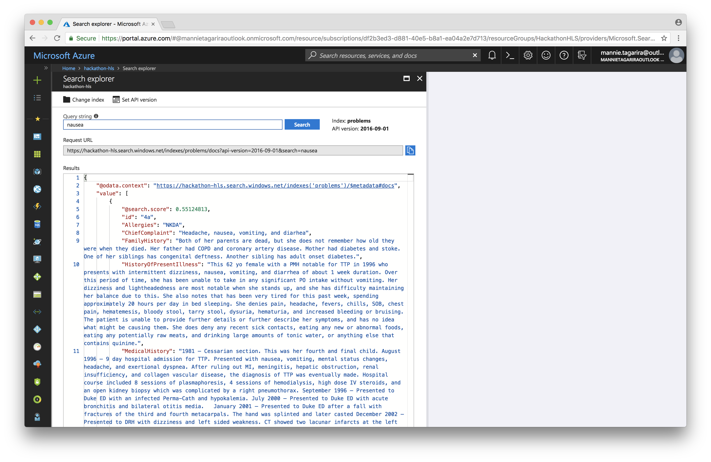

# Azure Search

Azure Search is a search-as-a-service cloud solution that gives developers APIs and tools for adding a rich search experience over your content in web, mobile, and enterprise applications.

Learn more about [Azure Search](https://azure.microsoft.com/en-us/services/search/) by referring to the [documentation](https://docs.microsoft.com/en-us/azure/search/).

---

1. Click _Create a resource_, and select _Azure Search_ under the _Mobile_ category.

1. Give the service a name and assign it to the previously created resource group.

1. Once the resource has deployed, select the _Import data_ option to create an indexer.

1. Connect to the Cosmos DB collection created in previous sections. Give the connection a name and click _OK_.

1. Give the _index_ a name, select the fields to index, and click _OK_.

1. Give the _indexer_ a name, select the _Schedule_ at which the indexer should run, and click _OK_.

1. From the Azure Search _Overview_ page, click _Indexers_ to see a run history of the indexers. 

1. If the indexer hasn't run yet, select it and click _Run_.

1. To test out the search functionality, select _Search explorer_ from the Azure Search _Overview_ page.

1. Enter a search term into the _Query string_ text field and click _Search_.

