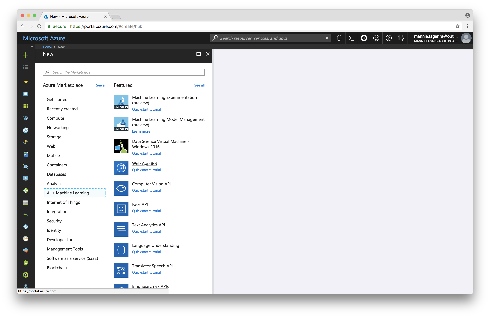
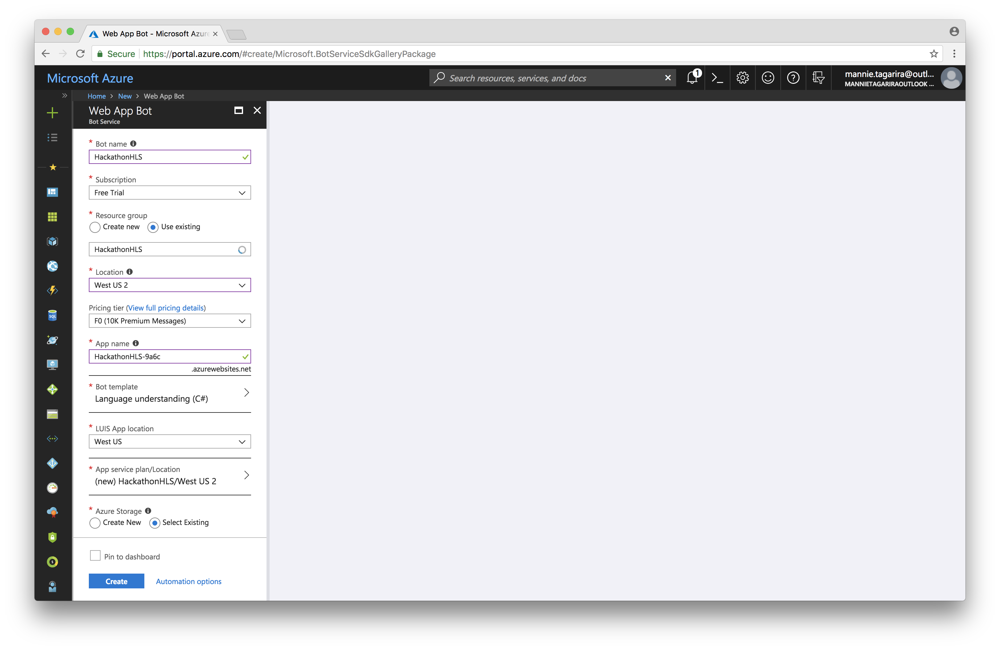
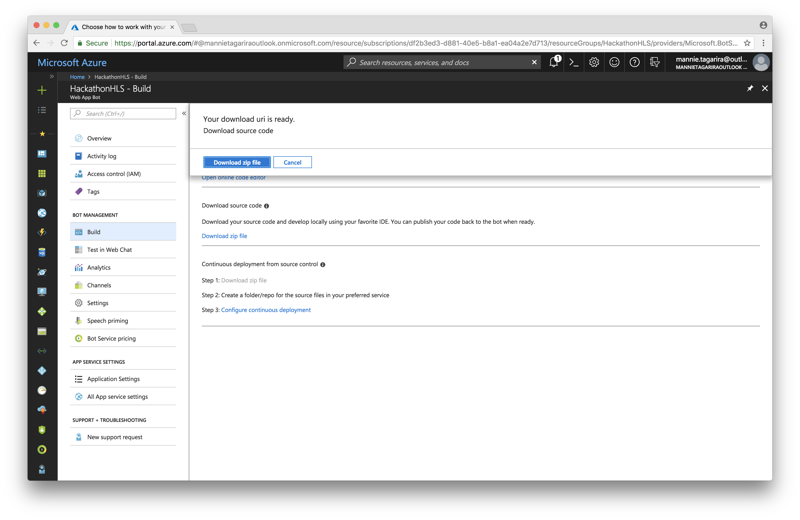
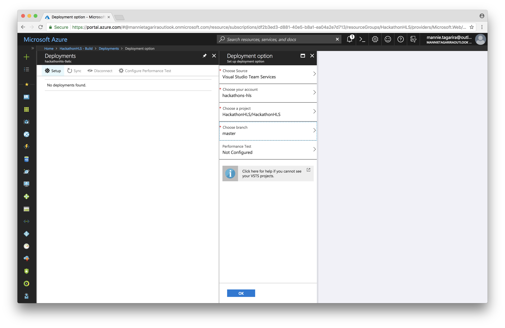
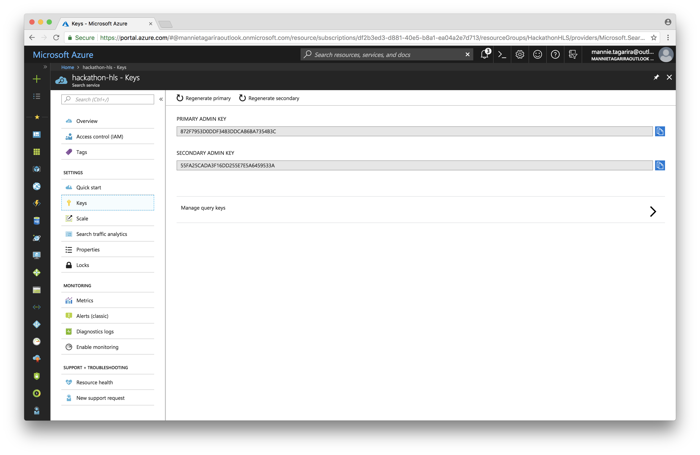

# Bot Service

A bot is an app that users interact with in a conversational way using text, graphics (cards), or speech. It may be a simple question and answer dialog, or a sophisticated bot that allows people to interact with services in an intelligent manner using pattern matching, state tracking and artificial intelligence techniques well-integrated with existing business services. 

Azure Bot Service provides tools to build, test, deploy, and manage intelligent bots all in one place. Through the modular and extensible framework provided by the SDK, developers can leverage templates to create bots that provide speech, language understanding, question and answer, and more. 

Learn more about [Bot Service](https://azure.microsoft.com/en-us/services/bot-service/) by referring to the [documentation](https://docs.microsoft.com/en-us/azure/bot-service/?view=azure-bot-service-3.0).

---

1. Click _Create a resource_ and select _Web App Bot_ from the _AI + Machine Learning_ section.

1. Give the bot a name and assign it to the resource group created earlier. Make sure to select _Language understanding_ as the _Bot template_ and C# as the development language.

1. For _Azure storeage_, select an existing one; select the one created for this hackathon as a side-effect of earlier stages. Acknowledge the notice and click _Create_.

1. Obtain the source code for the bot by clicking _Build_, then _Download zip file_. Once a download url has been generated, click _Download zip file_.

1. Create a new Git repo in VSTS; this is the repo which will be used for CD.

1. In the bot where we left off, click on _Configure continous deployment_.

1. Click _Setup_ and select the repository we created in prior steps. Click _OK_.

1. Extract the zip archive containing the bot's source code, and navigate to the extracted folder via CLI. Enter the commands in [cd.commands](cd.commands) to push the bot's source code to the VSTS repo. Ensure to update the URL to point to the new repo you just created.

1. Obtain an API key for Azure Search to use with the bot. Navigate to the Azure Search resource we created earlier, click _Keys_, and copy either primary or secondary keys.

1. Copy the code in [intent.snippet](intent.snippet) into _BasicLuisDialog.cs_ (in the _Dialogs_ folder of the bot's source code). Place it about the _Greeting_ intent. Be sure to update `uri` and `API_KEY` to the appropriate values in the process.

1. Paste the contents of [imports.snippet](imports.snippet) into _BasicLuisDialog.cs_, near the top of the file, close to the other import statements.

1. Push the changes to the git repo upstream; refer to [push.commands](push.commands).
