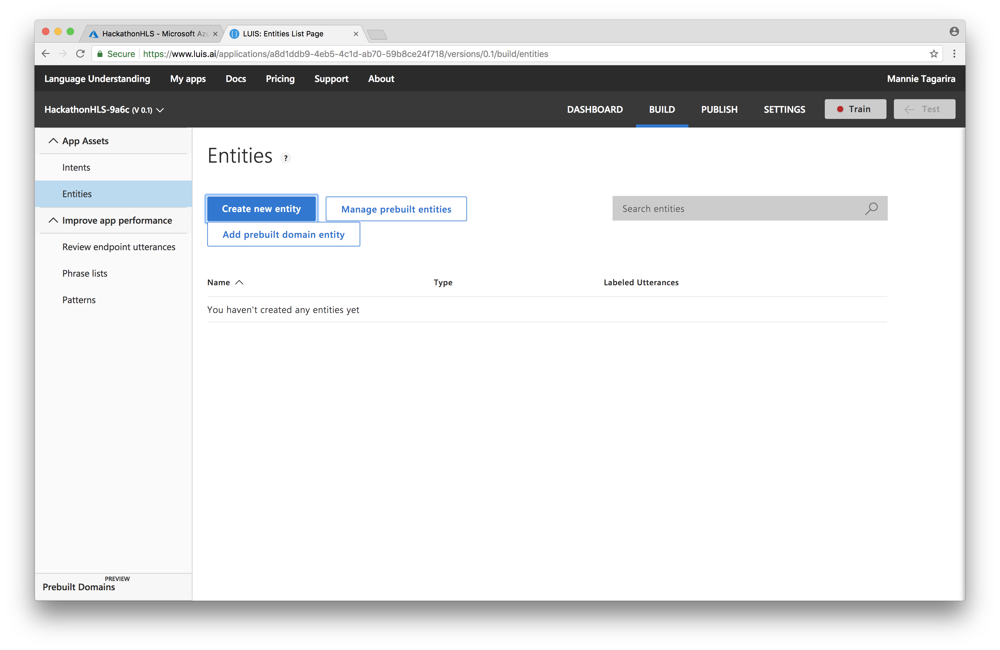
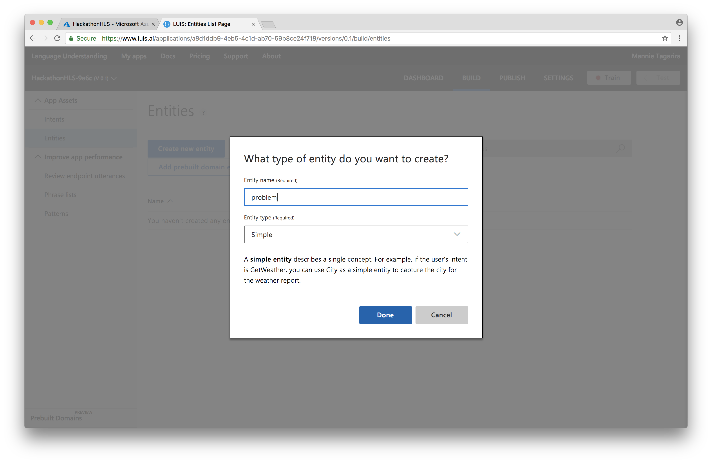
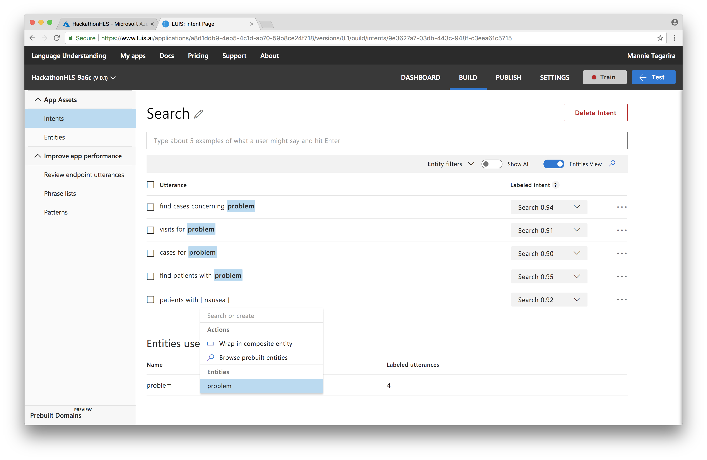

# Language Understanding Intelligent Service (LUIS)

Language Understanding (LUIS) allows your application to understand what a person wants in their own words. LUIS uses machine learning to allow developers to build applications that can receive user input in natural language and extract meaning from it. A client application that converses with the user can pass user input to a LUIS app and receive relevant, detailed information back.

Learn more about [LUIS](https://azure.microsoft.com/en-us/services/cognitive-services/language-understanding-intelligent-service/) by referring to the [documentation](https://docs.microsoft.com/en-us/azure/cognitive-services/luis/).

---

