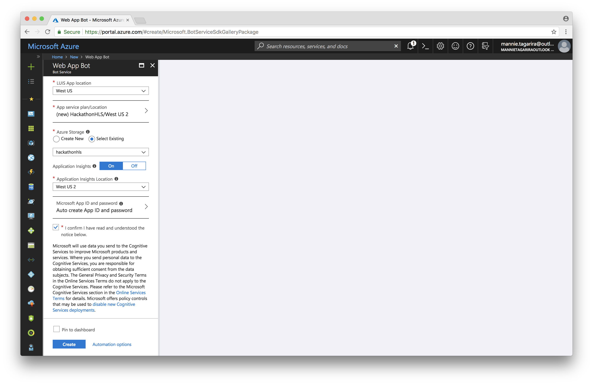

# Bot Service

A bot is an app that users interact with in a conversational way using text, graphics (cards), or speech. It may be a simple question and answer dialog, or a sophisticated bot that allows people to interact with services in an intelligent manner using pattern matching, state tracking and artificial intelligence techniques well-integrated with existing business services. 

Azure Bot Service provides tools to build, test, deploy, and manage intelligent bots all in one place. Through the modular and extensible framework provided by the SDK, developers can leverage templates to create bots that provide speech, language understanding, question and answer, and more. 

Learn more about [Bot Service](https://azure.microsoft.com/en-us/services/bot-service/) by referring to the [documentation](https://docs.microsoft.com/en-us/azure/bot-service/?view=azure-bot-service-3.0).

---





```
git init
git add .
git commit -m "Initial commit"
git remote add origin https://hackathons-hls.visualstudio.com/_git/HackathonHLS
git push -u origin --all
```


```
        [LuisIntent("Search")]
        public async Task SearchIntent(IDialogContext context, LuisResult result)
        {
            var problems = result.Entities.Where(e => e.Type == "problem").Select(p => p.Entity);

            var query = String.Join("+", problems);
            var uri = $"https://hackathon-hls.search.windows.net/indexes/problems/docs?api-version=2016-09-01&search={query}";

            var client = new HttpClient();
            client.DefaultRequestHeaders.Add("Accept", "application/json");
            client.DefaultRequestHeaders.Add("api-key", "API_KEY");

            var response = await client.GetAsync(uri);
            var jsonString = await response.Content.ReadAsStringAsync();
            dynamic json = JsonConvert.DeserializeObject<dynamic>(jsonString);

            var results = new List<String>();
            foreach (dynamic r in json.value)
                results.Add(r.id.ToString());

            await context.PostAsync($"Results found: {String.Join(", ", results)}");
            await context.PostAsync($"Query: {uri}");

            context.Wait(MessageReceived);
        }
```

```
using System.Linq;
using System.Net.Http;
using Newtonsoft.Json;
using System.Collections.Generic;
```


```
git add .
git commit -m "Add support for the Search LUIS intent"
git push
```


