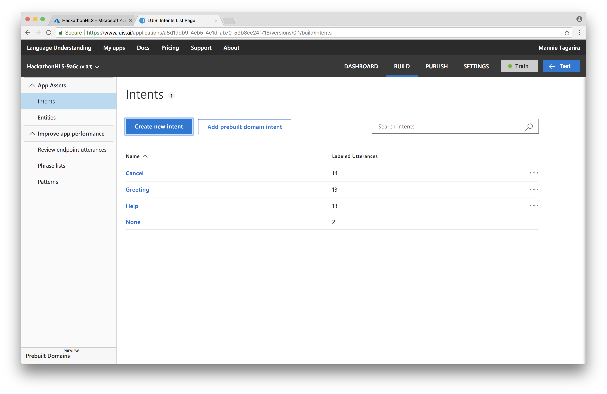
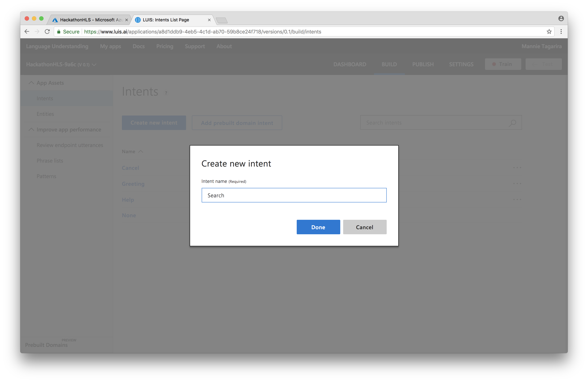
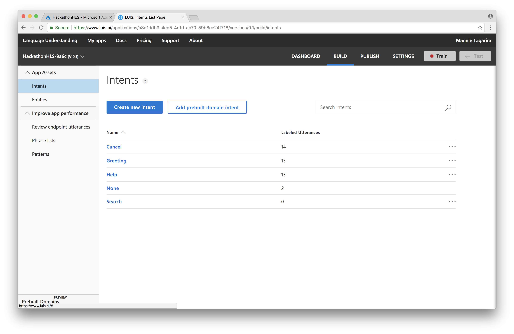
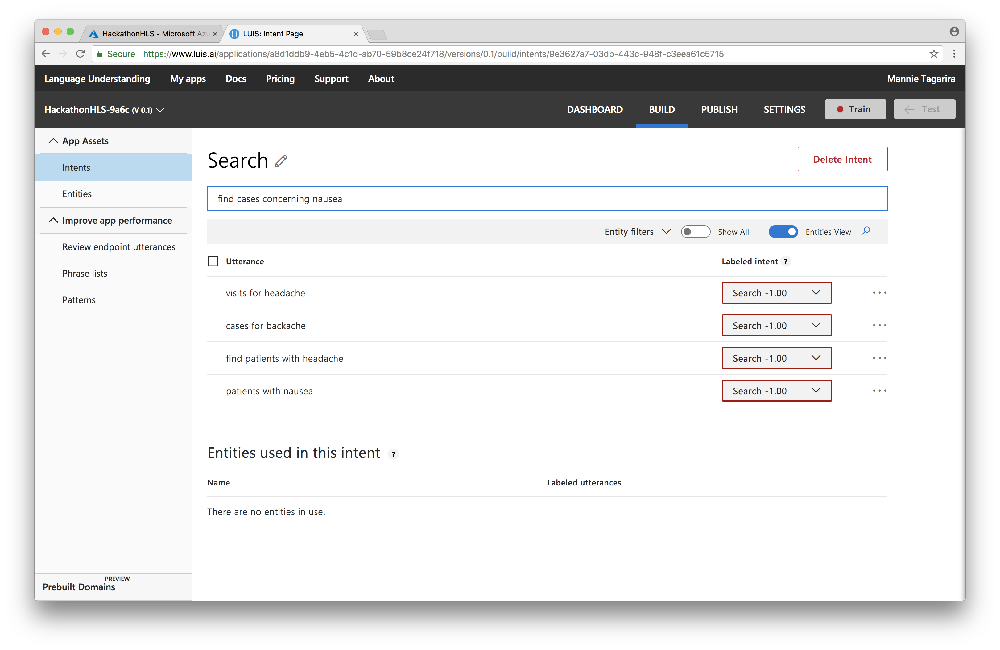
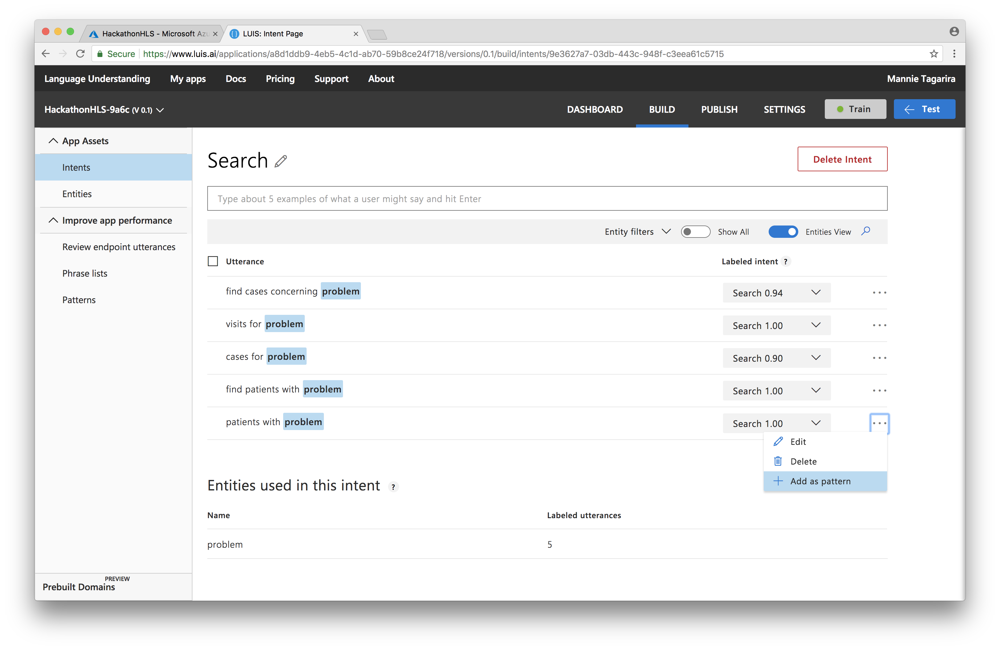
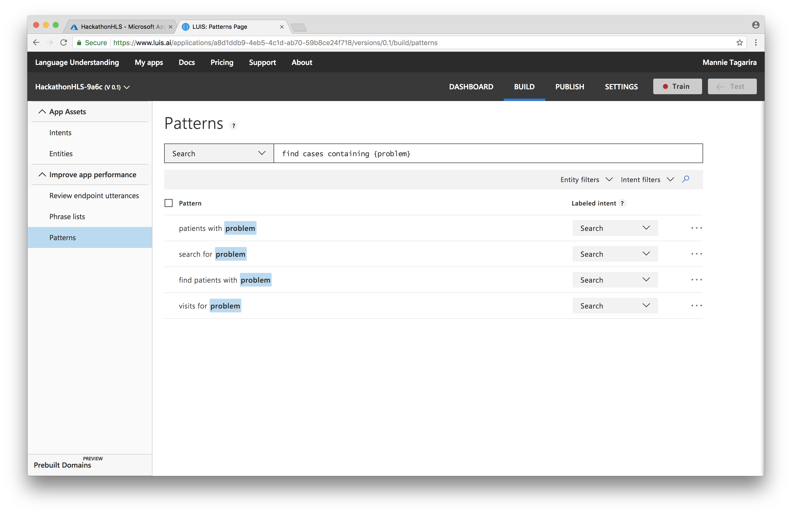
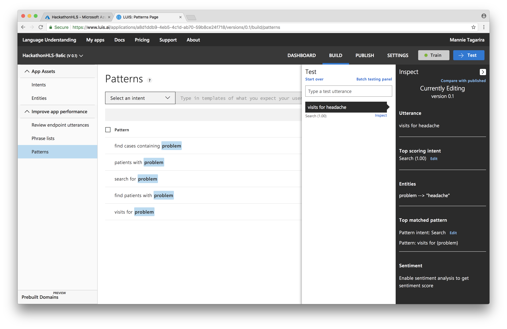
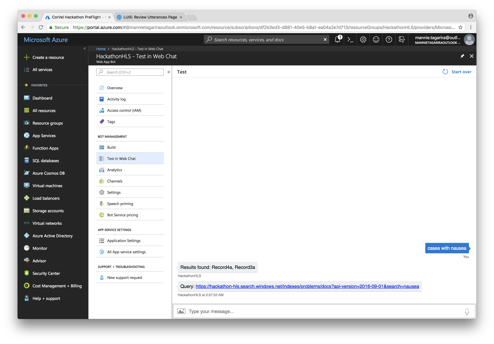

# Language Understanding Intelligent Service (LUIS)

Language Understanding (LUIS) allows your application to understand what a person wants in their own words. LUIS uses machine learning to allow developers to build applications that can receive user input in natural language and extract meaning from it. A client application that converses with the user can pass user input to a LUIS app and receive relevant, detailed information back.

Learn more about [LUIS](https://azure.microsoft.com/en-us/services/cognitive-services/language-understanding-intelligent-service/) by referring to the [documentation](https://docs.microsoft.com/en-us/azure/cognitive-services/luis/).

---

1. Navigate to the _Intents_ section and click _Create new intent_.

1. Give the intent a name and click _Done_.

1. Navigate to _Entities_ and select _Create new entity_.

1. Give the entity a name, ensure that it is of type _Simple, and click _Done_.

1. Navigate back to _Intents_ and select the Intent we just created.

1. Add a few utterances (from [utterances.list](utterances.list)) (i.e. what you would expect a user to say). 

1. For each utterance, click on the portions corresponding to the entity created in prior steps. Click on the entity from the pop-up to establish a link.

1. For each utterance that fits a pattern, click on the ellipses and select the _Add to pattern_ option.

1. Navigate to the _Patterns_ section and add a few more patterns (from [patterns.list](patterns.list)). Click _Train_ to update the ML model.

1. To verify the ML model, click _Test_ and enter an utterance. The intent and entity should be recognized as expected.

1. Navigate to the _Publish_ tab and click _Publish_ to publish the trained model.

1. To verify that the chatbot returns the expected data, navigate to the bot created in the previous section, click _Test in Web Chat_ and enter an utterance.

