# Azure Search Workshop

## Table of Contents
* [Prerequisites](#prerequisites)
* [Create a Resource Group](#create-a-resource-group)
* [Setting the Data Source Up](#setting-the-data-source-up)

## Prerequisites
* [Visual Studio](https://www.visualstudio.com/vs/) (with _Azure Development_ tools)
* [Azure Subscription](https://azure.microsoft.com/en-us/free/))
* [Azure Storage Explorer](https://azure.microsoft.com/en-us/features/storage-explorer/)

## Create a Resource Group
The _Resource Group_ will act as a container for all the different components of this project. Be sure to select a _Resouce Group Location_ that contains most/all of the following services as per [service availability reference](https://azure.microsoft.com/en-us/global-infrastructure/services/):
* Azure Service
* Azure Bot Service
* Language Understanding (LUIS)
* Service Bus
* Logic Apps
* Functions
* Visual Studio Team Services

1. Click _Resource Groups_ in the navigation menu.
1. Click _Add_ in the _Resource Groups_ panel.
1. Add a unique name for the resource group; give it a name related to the project.
1. Hit _Create_.

[go back to top](#azure-search-workshop)

## Setting the Data Source Up

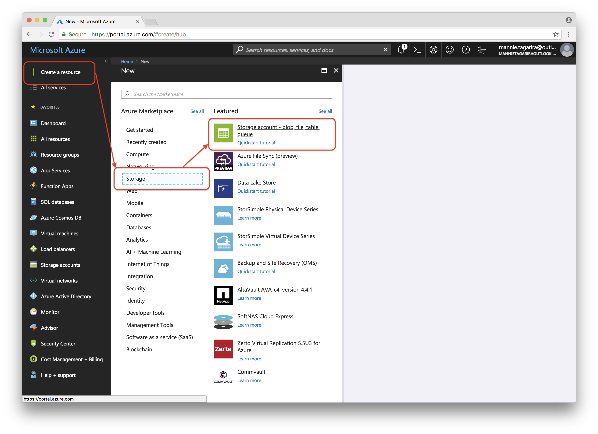
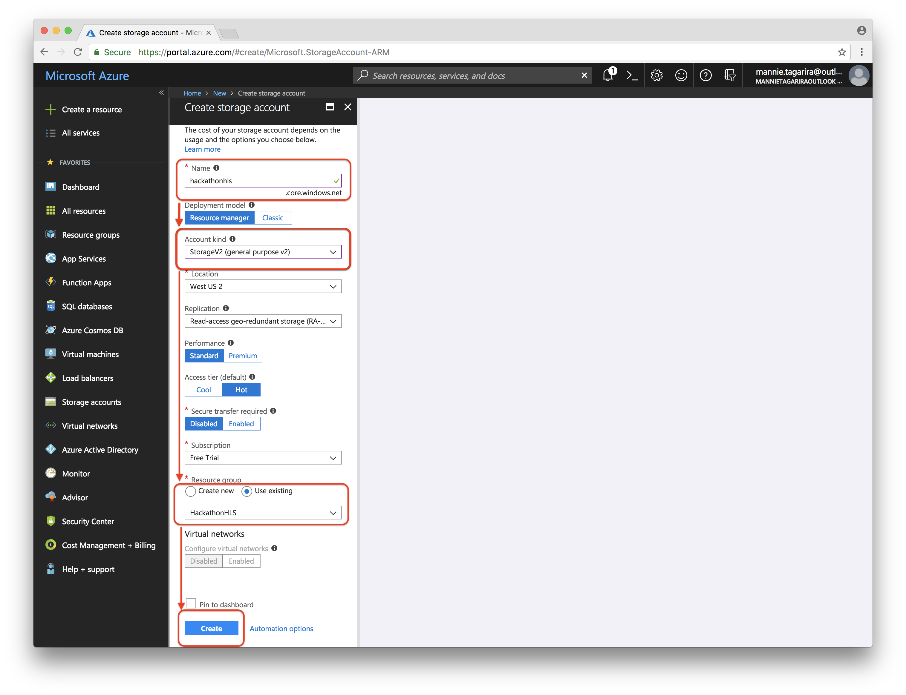
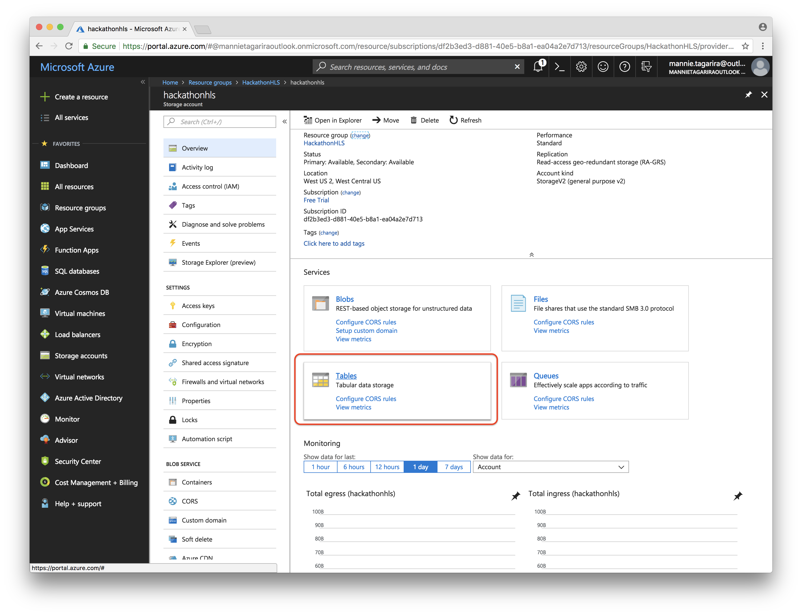
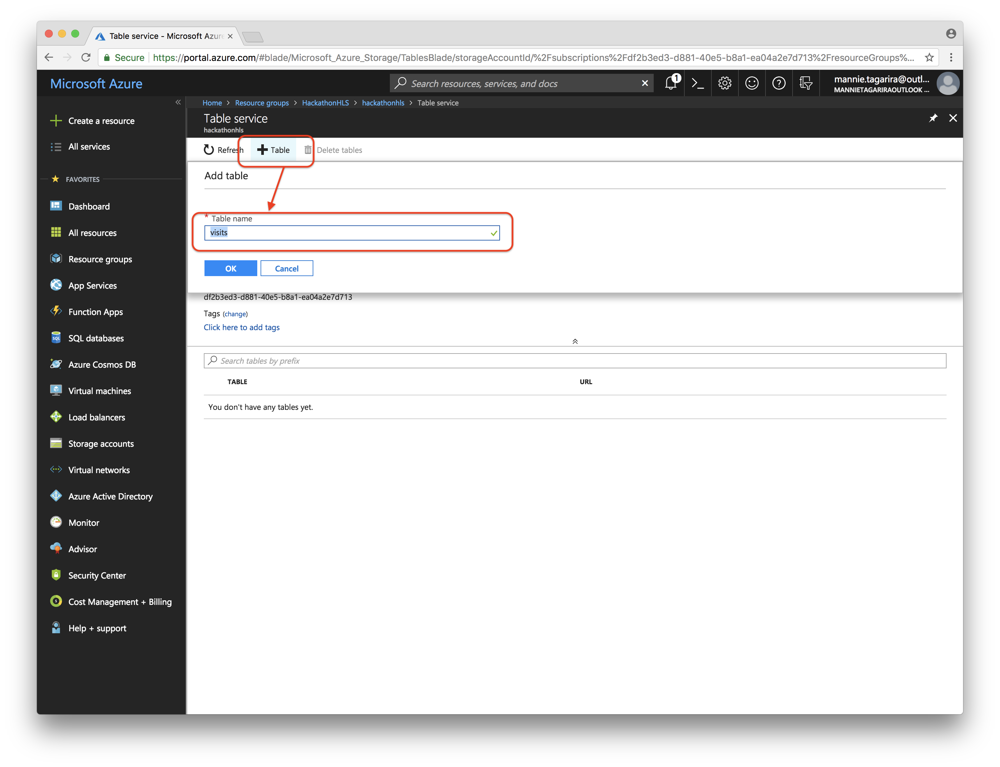
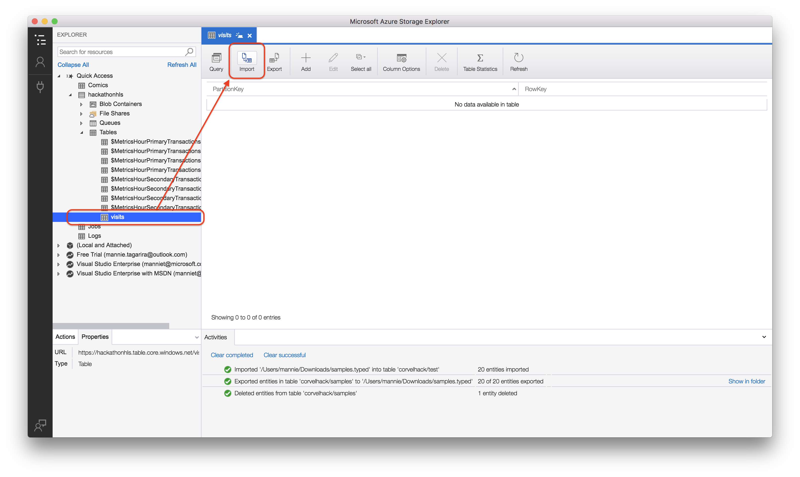
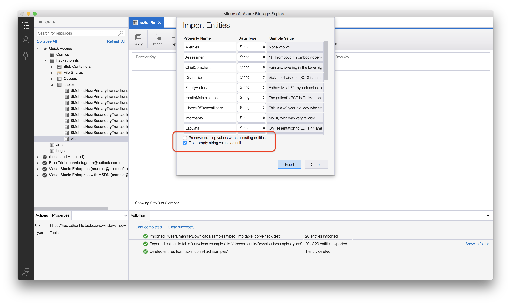

[go back to top](#azure-search-workshop)

## Azure Search
### Setting Up the Search
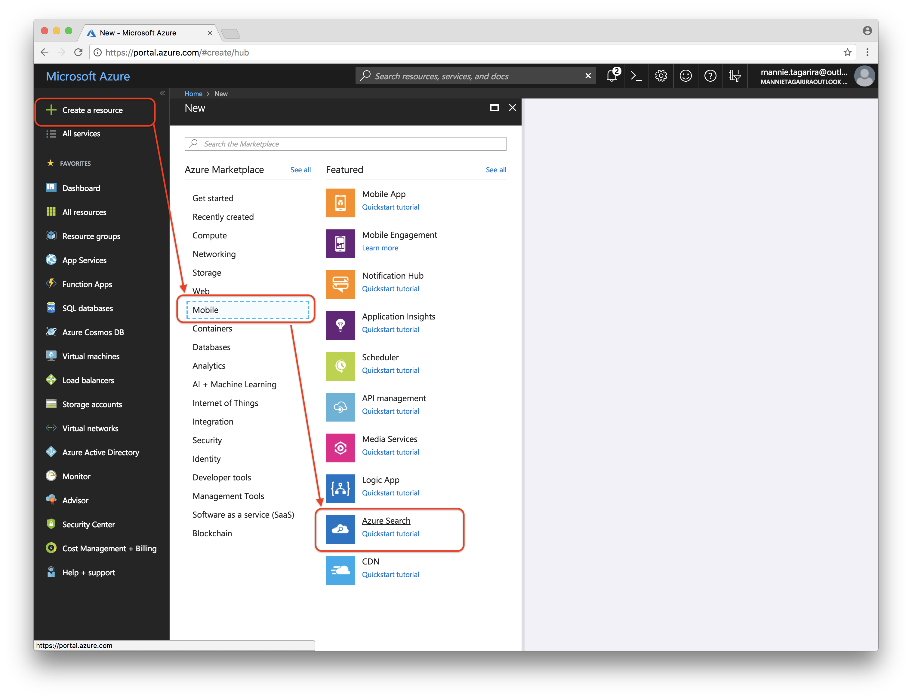
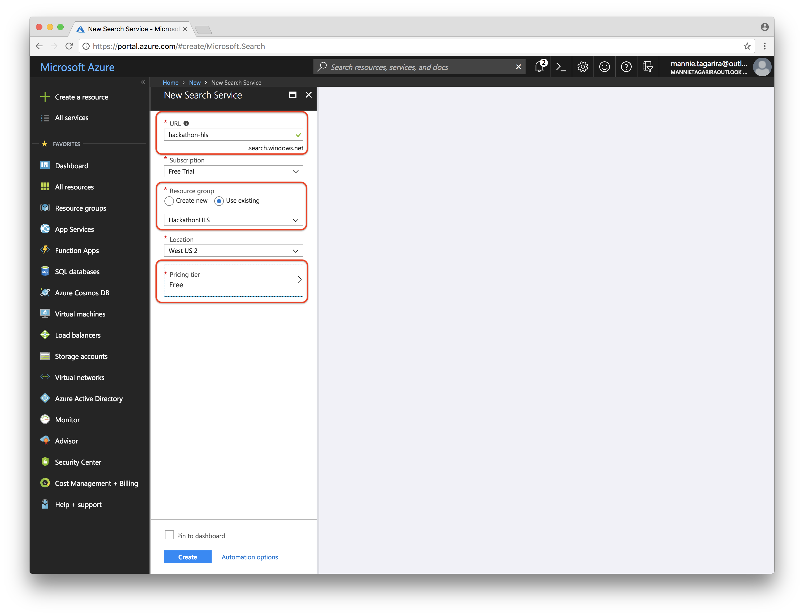

[go back to top](#azure-search-workshop)

### Creating An Index
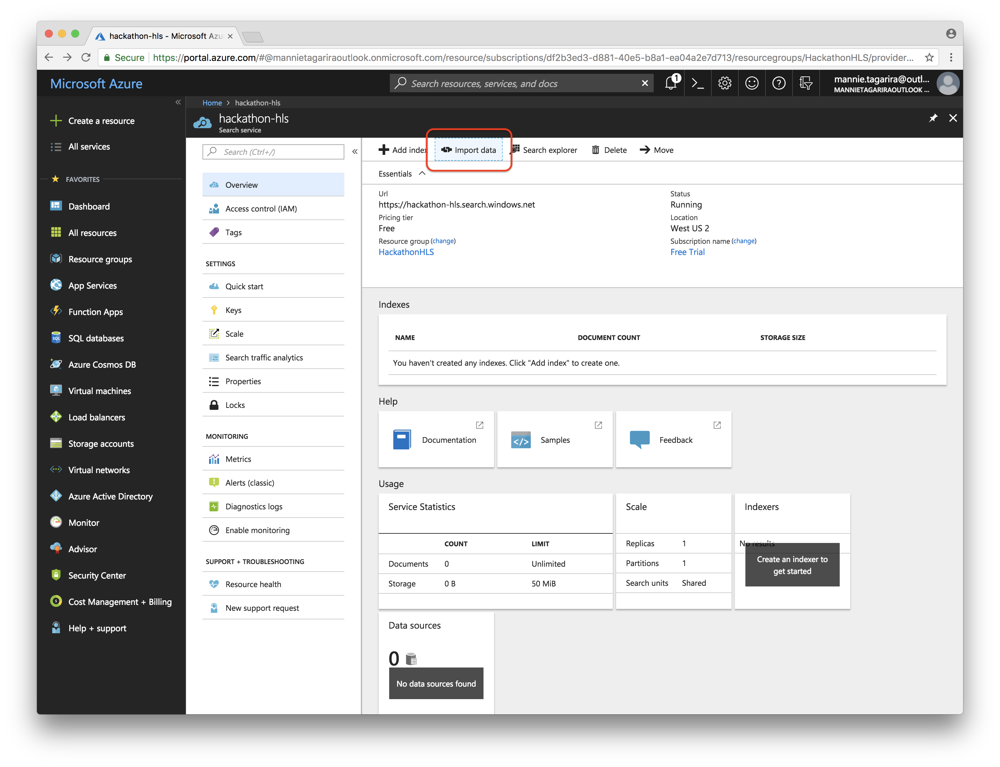
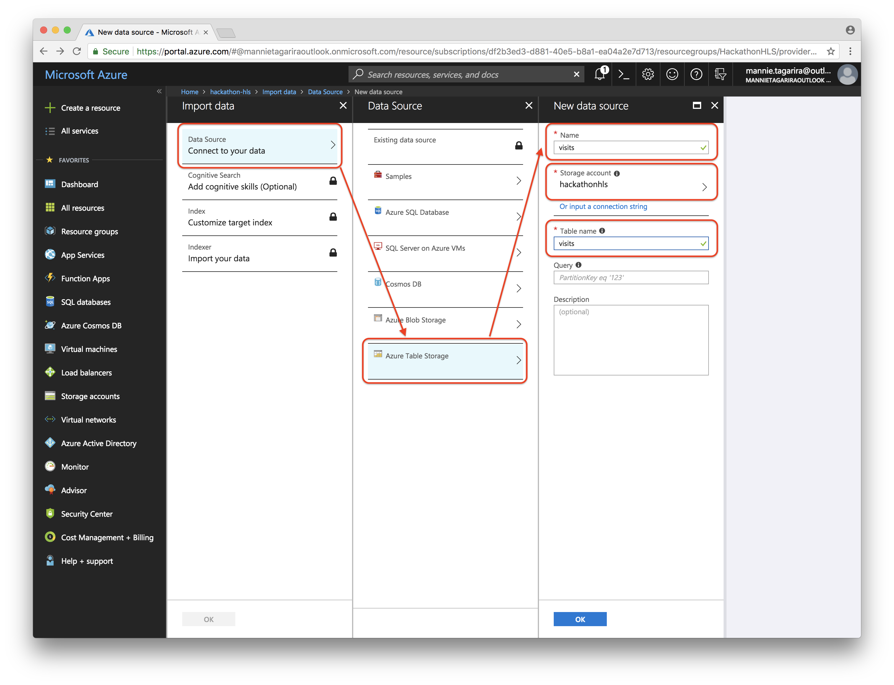
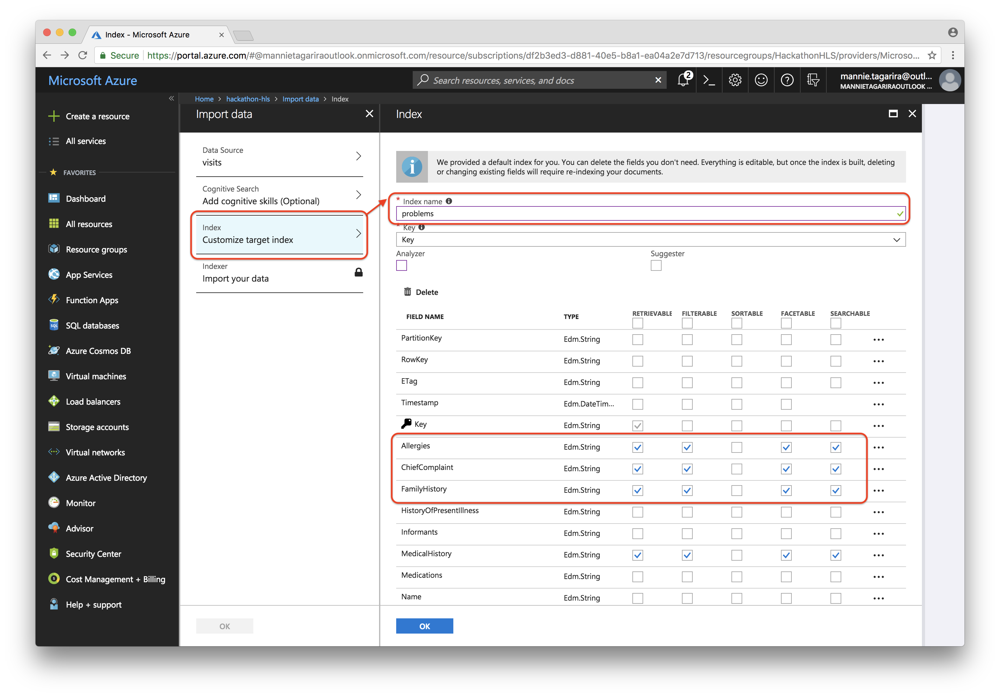
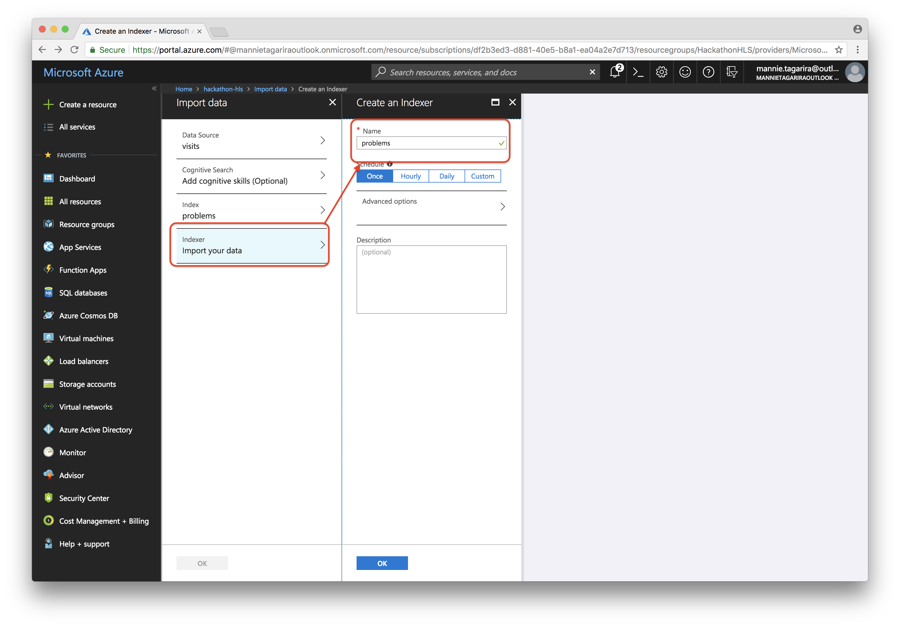
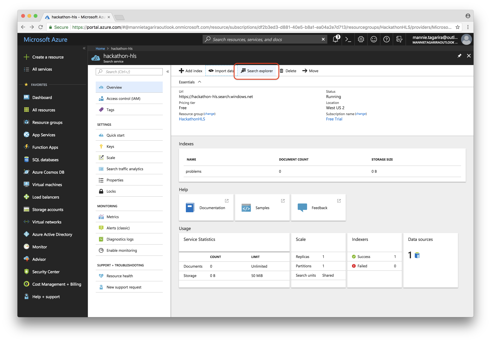
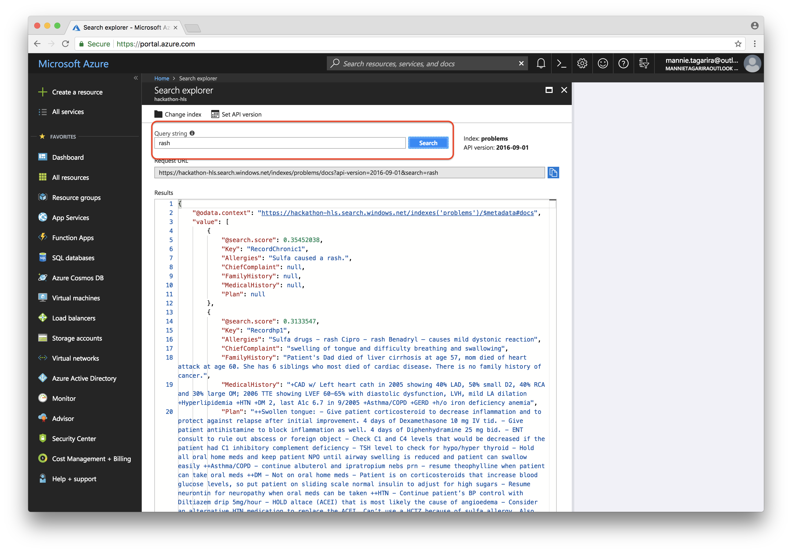

[go back to top](#azure-search-workshop)

